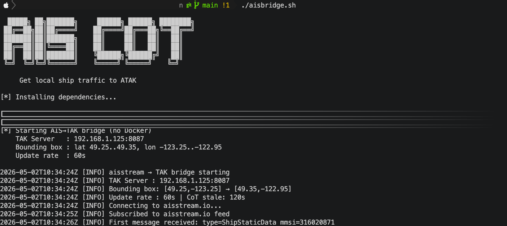

# AIS → TAK Gateway



Bridges live AIS vessel traffic from [aisstream.io](https://aisstream.io) into a TAK Server as Cursor on Target (CoT) events. Vessels appear as tracked contacts on ATAK, WinTAK, or any CoT-compatible client.

## Two Ways to Run

| | Method | Best for |
|---|---|---|
| 🐳 | **Docker** — `make build && make up` | Persistent background service |
| ⚡ | **Standalone** — `./aisbridge.sh` | Quick test, no Docker needed |

Both methods read the same `.env` file for configuration.

---

```
aisstream.io (WebSocket/WSS)
        │
        ▼
  aisstream_bridge.py   ← filters by ship type & bounding box
        │
        ▼ CoT XML over TCP
   TAK Server :8087
```

## Prerequisites

- A free [aisstream.io](https://aisstream.io/authenticate) API key (sign in with GitHub)
- A TAK Server reachable on your LAN (plain TCP CoT port, default 8087)
- **Docker mode:** Docker and Docker Compose
- **Standalone mode:** Python 3.8+

## Quick Start

**1. Clone the repo**

```bash
git clone <repo-url>
cd <repo-dir>
```

**2. Configure `.env`**

Copy the example and fill in your values:

```bash
cp .env.example .env   # or edit .env directly
```

At minimum you need to set:

| Variable | Description |
|---|---|
| `AISSTREAM_API_KEY` | Your aisstream.io API key |
| `TAK_HOST` | LAN IP of your TAK Server |
| `TAK_PORT` | CoT TCP port (default `8087`) |

**3. Build and start**

```bash
make build
make up
```

**4. Watch the logs**

```bash
make logs
```

You should see the bridge connect to aisstream.io, begin receiving messages, and push vessel positions to your TAK Server every `UPDATE_RATE` seconds.

## Configuration

All configuration is via the `.env` file. The bridge reads it at startup — restart the container after any change.

```env
# ── Required ─────────────────────────────────────────────────────────
AISSTREAM_API_KEY=your_key_here

TAK_HOST=192.168.1.66        # LAN IP of your TAK Server
TAK_PORT=8087                # Plain TCP CoT port

# ── Bounding Box ─────────────────────────────────────────────────────
# Geographic area to subscribe to. Vessels outside this box are ignored.
BBOX_LAT_MIN=48.8408
BBOX_LAT_MAX=49.7392
BBOX_LON_MIN=-123.7889
BBOX_LON_MAX=-122.4111

# ── Ship Type Filter ─────────────────────────────────────────────────
# Comma-separated AIS ship type numbers. Only these types are forwarded.
# Leave blank or remove to receive all types.
TYPE_FILTER=30,36,37,60,61,62,63,64,65,69,70,71,72,73,74,79,80,81,89

# ── Timing ───────────────────────────────────────────────────────────
UPDATE_RATE=60               # Seconds between position pushes to TAK
COT_STALE=120                # Seconds TAK holds a contact with no update
```

### Bounding Box

Use a tool like [bboxfinder.com](http://bboxfinder.com) to visually select your area of interest and read off the coordinates. The aisstream.io subscription is filtered server-side, so a tighter box reduces bandwidth and message volume.

### Ship Type Filter

Common AIS type numbers:

| Types | Category |
|---|---|
| 30 | Fishing |
| 31–32 | Towing |
| 35 | Military |
| 36 | Sailing |
| 37 | Pleasure craft |
| 60–69 | Passenger |
| 70–79 | Cargo |
| 80–89 | Tanker |

## Running Without Docker

`aisbridge.sh` is a helper script for testing the bridge directly on the host — no Docker required. It creates a Python venv, installs the only dependency (`websockets`), and runs `aisstream_bridge.py` using the same `.env` file.

**Requirements:** Python 3.8+ on the host machine.

```bash
# One-time setup
cp .env-TEMPLATE .env
# Edit .env and set AISSTREAM_API_KEY and TAK_HOST

chmod +x aisbridge.sh
./aisbridge.sh
```

The script will:
1. Validate that `.env` exists and required variables are set
2. Create `.venv/` in the project directory (first run only)
3. Install/upgrade `websockets` into the venv
4. Launch the bridge — output goes directly to the terminal

Press `Ctrl+C` to stop. The `.venv/` directory can be deleted at any time; it will be recreated on the next run.

## Makefile Targets

| Target | Description |
|---|---|
| `make build` | Build the Docker image |
| `make up` | Start the gateway (background) |
| `make down` | Stop and remove the container |
| `make restart` | Stop, rebuild, and start |
| `make rebuild` | Full clean rebuild (no layer cache) and start |
| `make logs` | Tail live container logs |
| `make status` | Show container status |
| `make shell` | Open a shell inside the running container |

## CoT Type Mapping

| AIS Ship Type | CoT Type | TAK Icon |
|---|---|---|
| Passenger (60–69) | `a-u-S-X-M-F` | Passenger vessel |
| Cargo (70–79) | `a-u-S-X-M-C` | Cargo vessel |
| Tanker (80–89) | `a-u-S-X-M-T` | Tanker |
| Military (35) | `a-f-S-X-M` | Military surface |
| Fishing (30) | `a-u-S-X-M` | Surface vessel |
| Sailing/Pleasure (36–37) | `a-u-S-X-L` | Light vessel |
| Unknown | `a-u-S-X-M` | Surface vessel |

## TAK Server Setup

The container uses `network_mode: host` so it can reach your TAK Server at its LAN IP directly. Ensure port `8087` (plain TCP CoT) is open and accepting connections on your TAK Server. No TLS is used on this port.

### Adding a Streaming Data Input (TAK Server Admin UI)

The gateway pushes CoT over a plain TCP connection to TAK Server. You need a **Streaming** input configured on port `8087` to receive it:

1. Open the TAK Server Admin UI (typically `https://<tak-server-ip>:8443/`)
2. Navigate to **Configuration → Inputs**
3. Click **Add Input**
4. Fill in the fields:

   | Field | Value |
   |---|---|
   | **Name** | `AIS Gateway` (or any label) |
   | **Protocol** | `TCP` |
   | **Port** | `8087` |
   | **CoT Type** | `Streaming` |
   | **Auth** | `Anonymous` |

5. Click **Save**, then verify the input shows a status of **Running**

Once the input is active and the gateway container is up, vessels will appear in connected ATAK/WinTAK clients within one `UPDATE_RATE` interval.

## Troubleshooting

**No vessels appearing in TAK**
- Check `make logs` — confirm the bridge is receiving messages and pushing CoT events
- Verify `TAK_HOST` and `TAK_PORT` are correct and reachable from the host machine
- Confirm your bounding box covers the area you expect

**aisstream.io connection drops / reconnects**
- Normal behaviour — the bridge reconnects automatically with exponential backoff (5s → 60s max)
- Check your API key is valid at [aisstream.io/authenticate](https://aisstream.io/authenticate)

**No messages received but connected**
- Your bounding box may not have any vessel traffic — try expanding it
- Your `TYPE_FILTER` may be excluding all vessels in the area
